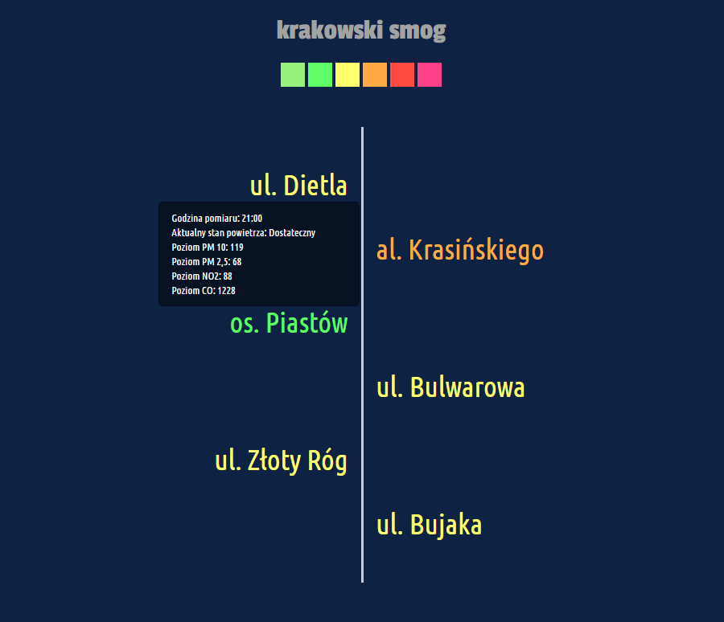
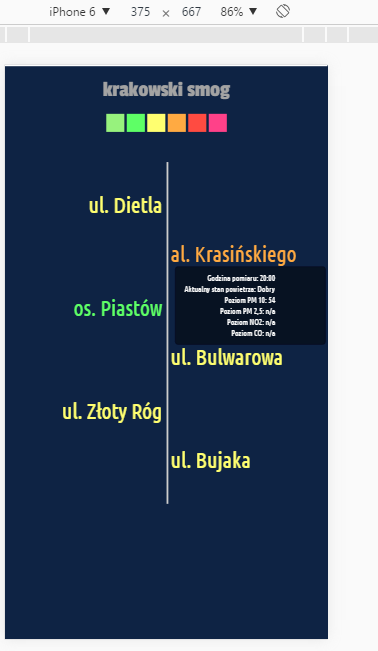

# krksmogapp
#### [live demo](http://prochal.com/smogapp//)
The krksmogapp is a minimalistic app, which purpose is to display current air quality in Kraków. Data is fetched from two APIs (powietrze.malopolska.pl / waqi.info) - the main one delivers more accurate parameters and the second one serves as a backup. While working on the project as a beginner I encountered some issues with powietrze.malopolska.pl and noticed that the main API can fail in several ways:

1. the API uses http instead of https, which causes Chrome to throw cors error. It also doesn't handle jsonp requests, so the only way was to use a proxy or to parse data from the web itself. 

2. proxy can die

3. API can die

4. API and proxy can live but return empty object (this happens during the sensors maintenance)

& more

On 2-4 scenarios the app switches to backup API.

